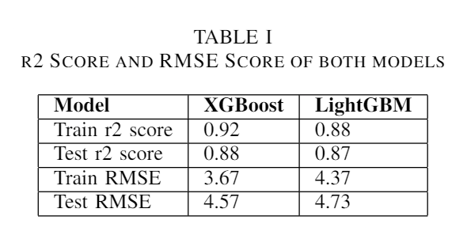
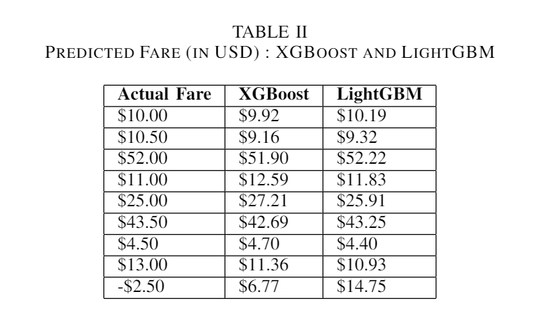

# NYC Taxi Fare Prediction using Machine Learning

This is a project we did in Applied Data Science for Practitioners course, applying LightGBM and XGBoost. The goal of this project is to predict the fare for taxi rides in NYC using the available public dataset. The model will help taxi companies and drivers to have a better understanding of the prices they can charge their customers, and make more informed business decisions.

## Data

The data used in this project was obtained from the NYC Taxi and Limousine Commission (TLC) and contains information on over 170 million taxi rides in NYC from 2009 to 2015. We took a whole month's worth of trip data, which included millions of rows. For training our model, we used half of the trip data from April 2022. The dataset includes the following features:

- pickup_datetime: date and time of the pickup
- pickup_longitude: longitude coordinate of the pickup location
- pickup_latitude: latitude coordinate of the pickup location
- dropoff_longitude: longitude coordinate of the dropoff location
- dropoff_latitude: latitude coordinate of the dropoff location
- passenger_count: number of passengers in the taxi
- distance: distance between pickup and dropoff locations
- fare_amount: fare charged for the ride

## Model Training & Testing

2 machine learning boosting models were used to predict the taxi fare in New York City. The models used in this project are:

- XGBoost
- LightGBM

## Comparison Analysis

## Result

## Future Work

In the future, we plan to use more models to learn about them for predicting NYC Taxi Fare more accurately.

